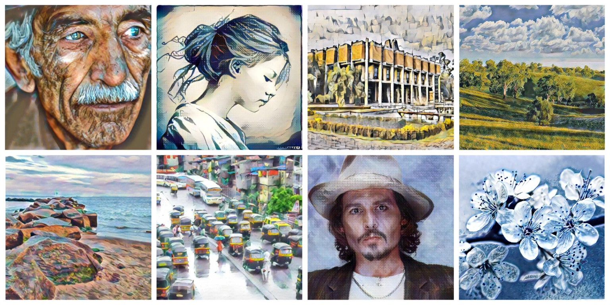

# SAFIN: Arbitrary Style Transfer With Self-Attentive Factorized Instance Normalization

This repository contains the code for our ICME 2021 paper:

Aaditya Singh*, Shreeshail Hingane*, Xinyu Gong and Zhangyang Wang. SAFIN: Arbitrary Style Transfer With Self-Attentive Factorized Instance Normalization, {[pdf](https://aaditya-singh.github.io/data/SAFIN.pdf)}).




## Requirements
Requirements should be installed by `pip install -r requirements.txt`

### Download models
Download [vgg_normalized.pth](https://www.dropbox.com/s/2elilhldqtqcumr/vgg_normalised.pth?dl=0)/[decoder.pth](https://www.dropbox.com/s/xveyz1yktk8s9l5/decoder.pth.tar?dl=0) and put them under `models/`.

### Test
Use `--content` and `--style` to provide the respective path to the content and style image.
```
CUDA_VISIBLE_DEVICES=<gpu_id> python test.py --net_file wave_net --content input/content/cornell.jpg --style input/style/woman_with_hat_matisse.jpg
```

You can also run the code on directories of content and style images using `--content_dir` and `--style_dir`. It will save every possible combination of content and styles to the output directory.
```
CUDA_VISIBLE_DEVICES=<gpu_id> python test.py --net_file wave_net --content_dir input/content --style_dir input/style
```

This is an example of mixing four styles by specifying `--style` and `--style_interpolation_weights` option.
```
CUDA_VISIBLE_DEVICES=<gpu_id> python test.py --net_file wave_net --content input/content/avril.jpg --style input/style/picasso_self_portrait.jpg,input/style/impronte_d_artista.jpg,input/style/trial.jpg,input/style/antimonocromatismo.jpg --style_interpolation_weights 1,1,1,1 --content_size 512 --style_size 512 --crop
```

Some other options:
* `--content_size`: New (minimum) size for the content image. Keeping the original size if set to 0.
* `--style_size`: New (minimum) size for the content image. Keeping the original size if set to 0.
* `--alpha`: Adjust the degree of stylization. It should be a value between 0.0 and 1.0 (default).
* `--preserve_color`: Preserve the color of the content image.


### Train
Use `--content_dir` and `--style_dir` to provide the respective directory to the content and style images.
```
CUDA_VISIBLE_DEVICES=<gpu_id> python train.py --net_file wave_net --content_dir <content_dir> --style_dir <style_dir> --start_iter 0 --save_dir ./save/
```

For more details and parameters, please refer to --help option.

## References
- [1]: [Pytorch implementation of AdaIN](https://github.com/naoto0804/pytorch-AdaIN)
